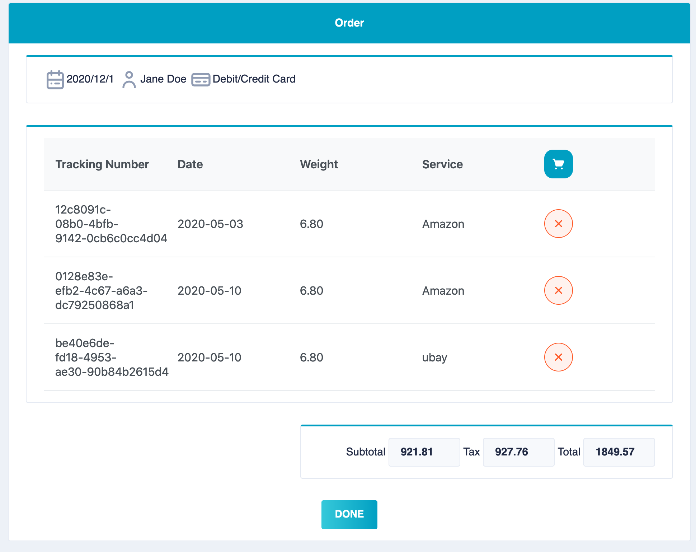

## Description

This is a MEAN stack project simulating a package tracking system using **Angular** and a REST API architectural style to consume services. For the client UI components i am trying **Primeng** and **Nebular** component libraries. 

## Screenshots




## Install

Install [Node.js](https://nodejs.org/en/)

```
npm install -g @angular/cli
```

This project is using mysql.

## Run Project

#### Api
```
npm runs start:dev
```

#### Client
```
ng serve
```

## Show your support

Give a ⭐️ if this project helped you!
***